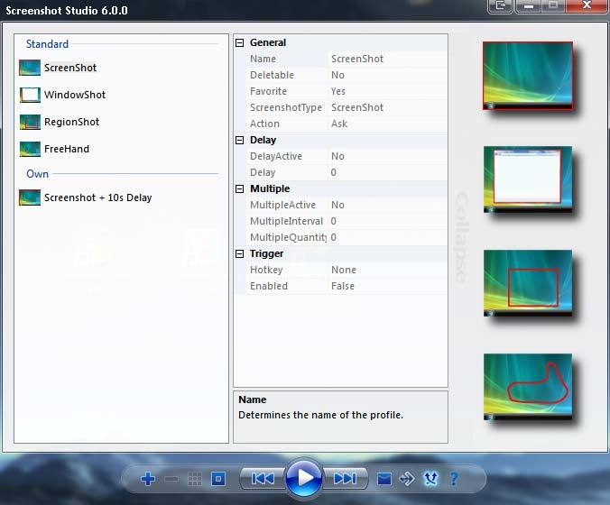

# ScreenshotStudio.Net

Screenshot Software that I wrote a about a decade ago (while I was still in school), using one of the earlier versions of the .Net Framework (~2.0). It is the successor to "SimpleScreenshot", a similar tool but written in Visual Basic 6, of which I unfortunately do not have the source code anymore.

The basic functionality should still be applicable to newer .Net Framework versions, so if someone needs code snippets of how to take screenshots, this might be of help.

